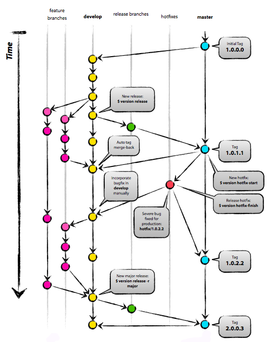

# Version Control

Increments version number based on git tags.

## Git Project Setup

Command                                 | Instructions
--------------------------------------- | ---------------------------------------
`cp version.py /usr/local/bin/version`  | Install the script on the developer and build machines.
`git init && version init`              | Init the repo and create the first tag.
`git checkout -b develop`               | Start commiting code on the develop branch.
`version release`                       | Create a new release from the develop to the master branch, pushing the changes to origin.

## Workflow

The initial version must be provided in the repository *master* branch for the current version to be extracted. Its format defines how the next versions are calculated:

 * 2 digits (`major.minor`) will produce a 3 digit version next
 * 3 digits (`major.minor.patch`) will continue the 3 digit scheme
 * 4 digits (`major.minor.patch.build`) will use the last field to keep a global counter of releases

`version init` will setup this for you using the 4 digits format by default.

Using the `release` command will merge the current *develop* into *master*, tagging it with the next patch version number and merging that tag back to *develop*.

The `hotfix-start` command creates a temporary branch from *master* where commits can be made and `hotfix-finish` will merge those changes back to *master* and tag it with the next patch version number. Hotfix commits can be manually merged into *develop* if needed.

## Jenkins Configuration

### Dependencies

* [Git Plugin](https://wiki.jenkins-ci.org/display/JENKINS/Git+Plugin)
* [EnvInject Plugin](https://wiki.jenkins-ci.org/display/JENKINS/EnvInject+Plugin)

### Source code management:

Configure your git repository URL and branch to build, then click advanced and set:

* Skip internal tag: true
* Use shallow clone: false

Otherwise you'll get the wrong version number.

### Build steps:

* Execute shell:  `echo CURRENT_VERSION=$(python "/usr/local/bin/version" show) > envvars`
* Inject environment variables - Properties File Path: `envvars`

The `CURRENT_VERSION` variable will then be available to use in your build environment, containing the version obtained from the most recent git tag.
